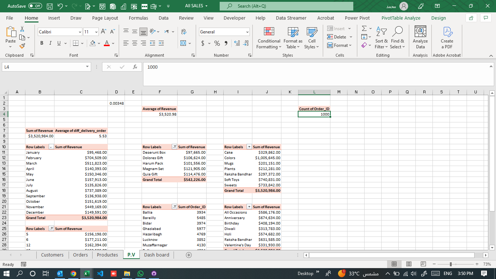

# Sweets-project
Sweets-Sales-Dashboard/
│
├─ README.md         # Descriptive dataset markdown
├─ sales-data.csv    # Your dataset (example: CSV format)
├─ dashboard.py      # Streamlit dashboard code
├─ requirements.txt  # Python dependencies (for Streamlit)
streamlit
pandas
matplotlib
# Sweets Sales Dashboard
# Dashboard Preview

This project includes an interactive dashboard for sweets sales analytics.

This dataset contains sales analytics for sweets products, including monthly revenue, top products, city-based orders, category distribution, delivery times, and occasion-based performance.

## Fields

| Field              | Description             |
|--------------------|------------------------|
| Revenue            | Total revenue          |
| Orders             | Number of orders       |
| Delivery Time      | Order delivery time    |
| Avg. Spend         | Avg customer spend     |
| Product            | Product name           |
| Category           | Product category       |
| Order Date         | Order date             |
| City               | Customer city          |
| Occasion           | Special occasion       |

## Insights

- Revenue peaks during specific months and occasions.
- The bestselling products are Desercunt Box, Dolores Gift, Harum Pack, Magnum Set, Qula Gift.
- Cakes and Chocolate categories yield the highest revenue.
- Major cities drive order volume.
- Celebration occasions (Birthday, Anniversary, Diwali, etc.) strongly influence sales trends.
- Hourly revenue peaks help optimize delivery operations.

---
import streamlit as st
import pandas as pd
import matplotlib.pyplot as plt

# Example: Load data from CSV
# df = pd.read_csv('sales-data.csv')

st.title("Sweets Sales Dashboard")

# Main Metrics
st.metric("Total Revenue", "$3,520,984.00")
st.metric("Total Orders", "1000")
st.metric("Avg Order Delivery Time", "5.53")
st.metric("Avg Customer Spend", "$3,520.98")

# Revenue by Month
st.subheader("Revenue by Month")
months = ["Jan", "Feb", "Mar", "Apr", "May", "Jun", "Jul", "Aug", "Sep", "Oct", "Nov", "Dec"]
revenue = [500, 600, 550, 700, 750, 400, 650, 720, 680, 710, 620, 560]
fig, ax = plt.subplots()
ax.plot(months, revenue, marker='o')
st.pyplot(fig)

# Top 5 Products
st.subheader("Top 5 Products")
products = ['Desercunt Box', 'Dolores Gift', 'Harum Pack', 'Magnum Set', 'Qula Gift']
sales = [10000, 11500, 10500, 12000, 11700]
prod_df = pd.DataFrame({'Product': products, 'Sales': sales})
st.bar_chart(prod_df.set_index('Product'))

# Revenue by Category
st.subheader("Revenue by Category")
categories = ['Cake', 'Choco', 'Plants', 'Raksha', 'Sweet Box', 'Sweets']
cat_rev = [0.4, 1.0, 0.25, 0.3, 0.9, 0.7]
cat_df = pd.DataFrame({'Category': categories, 'Revenue': cat_rev})
st.bar_chart(cat_df.set_index('Category'))

# Revenue by Occasion
st.subheader("Revenue by Occasion")
occasions = ['Anniversary', 'Birthday', 'Diwali', 'Holi', 'Raksha Bandhan', "Valentine's Day"]
occ_rev = [650, 720, 680, 710, 620, 560]
occ_df = pd.DataFrame({'Occasion': occasions, 'Revenue': occ_rev})
st.bar_chart(occ_df.set_index('Occasion'))
Analytical Insights from Dashboard
Revenue fluctuates across months, indicating clear seasonality and holiday demand spikes.​

Certain products consistently outperform others, suggesting high customer preference for these items.​

Cakes and chocolates generate more revenue than other categories, which can guide inventory and promotional focus.​

Top cities contribute the highest number of orders, making them prime targets for marketing.​

Occasions like birthdays, anniversaries, Diwali, and Holi significantly impact order volume, requiring tailored offers around these dates.​

Distinct hourly order trends provide actionable insights for optimizing delivery times and staffing.​

